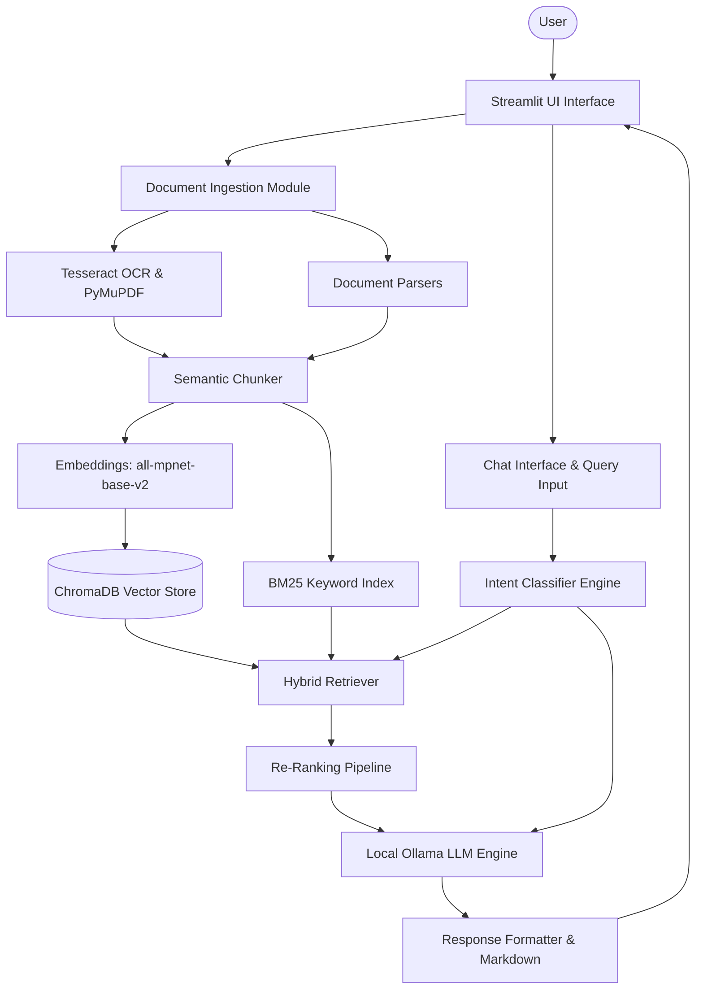

# 🔬 ResearchHelp-AI Analysis System: Advanced AI Document Research & Publishing System

## 📄 Project Overview

ResearchHelp-AI Analysis System is a next-generation, multi-modal document analysis platform that transforms raw files into structured, queryable knowledge bases. By leveraging **semantic embeddings**, **hybrid retrieval (Vector + BM25)**, **LLM streaming**, and **rich multimedia integrations**, it enables deep research Q&A, auto-generated suggestions, and professional academic publishing — all directly from your uploaded files.

### ✨ Key Differentiators & Upgrades
- **100% Local Inference & Total Privacy**: Zero data leaves your machine. Upload confidential documents, patents, and private code bases with complete security.
- **[NEW] Smart Local Model Routing (Hybrid LLMs)**: Automatically distributes workloads across three specialized local LLMs (Llama 3.1 8B, Qwen 2.5 3B, Gemma 3 4B) depending on task complexity and type.
- **Zero API Costs & Unlimited Queries**: Replaced expensive cloud APIs with local Ollama endpoints.
- **Local LLM Health Dashboard**: Real-time status card integrated into the sidebar detecting Ollama connection status.
- **Dynamic 44-Domain Adaptation**: Automatically detects research domains in your queries and documents to inject expert-level analytical frameworks.
- **🎓 IEEE Official Paper Generator**: Synthesize academic manuscripts complete with Abstracts, Literature Reviews, and Methodologies, auto-formatted into professional `.docx` files.
- **🖼️ AI Image Generation & 📊 Interactive Flowcharts**: Dynamically generate AI images (Pollinations.ai) and live Mermaid flowcharts matching the app's theme.

---

## 🧠 Advanced Intent Classification System
At the heart of ResearchHelp-AI-anaylsis-system is a smart routing engine that categorizes every query before processing. This ensures the correct prompt template, specialized LLM model, and analysis logic are applied.

| Intent Category | Trigger Example | Local LLM Assigned | Functionality |
|-----------------|-----------------|--------------------|---------------|
| 📄 `document_qa` | "What hardware is used?" | `llama3.1:8b` (General) | Direct factual Q&A from the document context. |
| 💡 `suggestion_request` | "How can we improve this?" | `gemma3:4b` (Reasoning) | Gap analysis and actionable improvement suggestions. |
| 🔬 `research_addon` | "Can we add solar power?" | `gemma3:4b` (Reasoning) | Technical feasibility assessment and risk analysis. |
| 🧪 `research_analysis` | "Explain Quantum Computing" | `gemma3:4b` (Reasoning) | Deep analysis in **VERY SIMPLE English** with analogies. |
| 🎓 `ieee_paper_gen` | "Generate an IEEE paper" | `llama3.1:8b` (General) | Synthesizes a formal research manuscript in DOCX format. |
| 🚫 `off_topic` | "What is the weather?" | `llama3.1:8b` (General) | Polite redirection to keep the session focused. |

*Note: Any coding tasks or **Mermaid Diagram Generation** requests are always routed to `qwen2.5:3b` for structural correctness.*

---

## 🏗️ System Architecture



---

## 💻 Technical Stack & Dependencies

- **Frontend Interface**: [Streamlit](https://streamlit.io/) with custom CSS / theming.
- **Vector Database**: [ChromaDB](https://www.trychroma.com/) (Persistent local storage).
- **AI & ML Models (Local)**:
  - **Ollama Engine**: Running local inference via HTTP REST API.
  - **Llama 3.1 8B**: Primary general Q&A and standard classification tasks.
  - **Qwen 2.5 3B**: Coding and Mermaid diagram rendering (ensuring structural validation).
  - **Gemma 3 4B**: Advanced logical reasoning and multi-document synthesis.
  - **Embeddings**: `sentence-transformers/all-mpnet-base-v2` (768-dim, locally executed).
- **Retrieval Infrastructure**: `rank-bm25` (Okapi algorithm) + ChromaDB native similarity search.
- **Document Parsing Suite**: `PyMuPDF (fitz)`, `python-docx`, `pytesseract` + `Pillow`, `pandas`.
- **Multimedia Rendering**:
  - Code visualizer: `Mermaid.js` (Frontend CDN).
  - Text-to-Speech: Web Speech API (Client-side execution).
  - Automated imagery: `Pollinations.ai` (REST Generation).

---

## 📂 Code & Project Structure

```
ResearchHelp_AI_Analysis_system/
├── app.py                     # Main Streamlit Application UI
├── pyproject.toml             # Project configuration (pytest, etc.)
├── requirements.txt           # Dependency requirements
├── tests/                     # Unit & Integration Tests
└── src/                       # Core Source Code
    ├── __init__.py
    ├── config.py              # Environment and Configuration Management
    ├── extractor.py           # Document OCR and Parsing
    ├── text_preprocessor.py   # Cleaning and chunking text
    ├── llm_client.py          # Ollama local LLM interfacing
    ├── qa_engine.py           # RAG retrieval and response generation
    ├── intent_classifier.py   # Intent routing based on user prompt
    ├── prompt_templates.py    # Master AI Prompts and Mermaid rules
    ├── mermaid_renderer.py    # Diagram generation validation and UI fixing
    ├── research_engine.py     # Deep analysis and auto-suggestion generators
    ├── topic_segmenter.py     # Semantic boundary detection
    ├── confidence_scorer.py   # Deterministic validation of outputs
    └── logging_utils.py       # Standardized logging
```

---

## 🔄 Data Flow

1. **Ingestion**: User uploads documents -> System extracts text via PyMuPDF/OCR.
2. **Indexing**: Text is semantically chunked, vectorized using MPNet, and stored in ChromaDB (Semantic) and BM25 (Keyword).
3. **Querying**: User asks a question -> `intent_classifier.py` determines domain and intent (e.g., QA, IEEE Paper, Suggestion).
4. **Retrieval**: System fetches top chunks from ChromaDB and BM25 -> Deduplicates and Re-Ranks.
5. **Generation**: The prompt, context, and query are sent to the assigned local LLM (e.g., `llama3.1:8b`, `gemma3:4b`, or `qwen2.5:3b`) via `llm_client.py`.
6. **Rendering**: The response is streamed back, Markdown and Mermaid graphs are sanitized, and presented to the user.

---

## 🗄️ Database Schema & Models

While the system does not use a traditional relational SQL database, it leverages **ChromaDB** for persistent vector storage.
- **Collections**: Separated by document batches.
- **Embeddings**: 768-dimensional float arrays (from `all-mpnet-base-v2`).
- **Metadata**: Each chunk stores `filename`, `page_number`, `topic_label`, and `chunk_index` to allow precise citations.

---

## 🔌 API Endpoints

The system is primarily UI-driven, but it communicates heavily with the local Ollama API:
- `POST /api/chat`: Used by `llm_client.py` for streaming chat completions.
- `GET /api/tags`: Used by the health dashboard to check if the required local models (`llama3.1:8b`, `gemma3:4b`, `qwen2.5:3b`) are pulled and available.
- `POST /api/generate`: Used for fast completions like Intent Classification.

---

## 🔒 Security Measures

- **Total Data Privacy**: As a 100% local solution, NO user documents, queries, or AI responses are sent to the cloud.
- **App Password**: Configurable `APP_PASSWORD` in `.env` blocks unauthorized access to the UI (verified via `hmac.compare_digest`).
- **Path Traversal Prevention**: Strict `sanitize_filename` functions strip malicious paths during upload.
- **XSS & Injection Protection**: User input is sanitized; Mermaid code is validated and cleaned by `MermaidCleaner` before HTML rendering to prevent DOM exploits.

---

## 🚀 Deployment & Installation Steps

### Prerequisites
- **Python 3.10+** and **Git**
- **Ollama**: Download from [Ollama's Official Website](https://ollama.com).
- **Tesseract OCR**: 
  - Windows: [UB-Mannheim/tesseract](https://github.com/UB-Mannheim/tesseract/wiki) (Default: `C:\Program Files\Tesseract-OCR\tesseract.exe`)
  - macOS: `brew install tesseract` | Linux: `sudo apt-get install tesseract-ocr`

### 1. Clone & Set Up Virtual Environment
```bash
git clone https://github.com/your-username/ResearchHelp-AI-anaylsis-system.git
cd ResearchHelp-AI-anaylsis-system
python -m venv venv
# Windows: .\venv\Scripts\Activate  |  macOS/Linux: source venv/bin/activate
```

### 2. Install Dependencies
```bash
pip install -r requirements.txt
```

### 3. Pull the Local LLMs
```bash
ollama pull llama3.1:8b
ollama pull qwen2.5:3b
ollama pull gemma3:4b
```

### 4. Configure Environment Variables
Create a `.env` file in the root:
```env
OLLAMA_BASE_URL=http://localhost:11434
APP_PASSWORD=your_secure_password  # Optional UI lock
LOG_LEVEL=INFO
```

### 5. Run the Application
```bash
streamlit run app.py
```

---

## ⚙️ Error Handling & Logging

- **Logging**: Standardized application-wide logging configured in `src/logging_utils.py`. Controlled by `LOG_LEVEL` in `.env`.
- **API Retries**: The `llm_client.py` utilizes the `tenacity` library to automatically implement exponential backoff and retry logic if the Ollama server crashes or times out.
- **Rate Limiting Guardrails**: Built-in Streamlit session locks prevent users from spamming uploads while a massive document is currently being ingested.
- **Safe Fallbacks**: If a generated Mermaid diagram contains hallucinatory syntax, `mermaid_renderer.py` automatically strips breaking characters or falls back to an error card instead of crashing the UI.

---

## ⚡ Performance Optimization

- **Session Caching**: UI heavy functions and config validations use `@st.cache_data(ttl=60)` to prevent recalculations on every render tick.
- **Hybrid Search Efficiency**: BM25 keyword matching is strictly run in memory and only on the chunks fetched by ChromaDB to reduce latency.
- **Streaming Tokens**: Responses are streamed chunk-by-chunk to the frontend so the user gets instant feedback instead of waiting 15 seconds for a large analysis.

---

## 🛠️ Testing Strategy & Maintenance

Run different tests based on your needs:

### 1. Pytest Suite
Run comprehensive tests validating configuration, model routing, and request payloads:
```bash
pytest tests/test_ollama_migration.py -v
```
*(Tests mock external requests so they run instantly without needing a running Ollama server)*

### 2. Live Diagnostics
To run basic RAG and embedding tests on your live system:
```bash
python test_pipeline.py
```

---

## 🔮 Future Roadmap & FAQ

**Roadmap:**
- [ ] **Multi-Agent Debates**: Implement distinct personas that argue different sides of a research query before delivering a final answer.
- [ ] **Web Search Integration**: Add an optional toggle to scrape live arXiv and PubMed papers to supplement local documents.
- [ ] **GraphRAG**: Transition from chunk-based semantic search to true Knowledge Graphs for extreme relational awareness.

**FAQ:**
- **Why is it slow on my laptop?**
  Running LLMs locally requires a decent GPU (e.g., Nvidia RTX 3060+) or an Apple Silicon Mac (M1/M2/M3 with 16GB+ RAM) for fast token generation. Without a GPU, Ollama falls back to CPU which is significantly slower.
- **Can I use a different model?**
  Yes, modify `OLLAMA_PRIMARY_MODEL` in `.env` (e.g., to `mistral` or `qwen2.5`). Just ensure it is pulled in Ollama first.

---
Built with ❤️ and Python.
